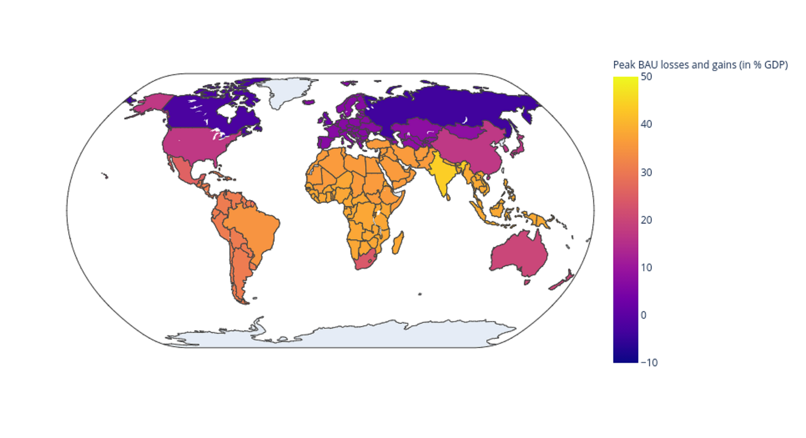

# Can Today’s and Tomorrow’s World Uniformly Gain from Carbon Taxation?

<p align="center">

</p>


## Organization of the repository

This repository is mainly based on MATLAB (and a bit on Python 3.x) and supplements the work of [Larry Kotlikoff](https://kotlikoff.net/), [Felix Kuebler](https://sites.google.com/site/fkubler/), [Andrey Polbin](https://cepr.org/about/people/andrey-polbin), and [Simon Scheidegger](https://sites.google.com/site/simonscheidegger), titled _[Can Today’s and Tomorrow’s World Uniformly Gain from Carbon Taxation?](#citation)_ (Kotlikoff et al.; 2024, conditionally accepted at the `European Economic Review').

* This repository contains three types of files:
  1. ["Codes that reproduce the simulation results"](codes_and_data): Replication routines for the numerical results in the article.
      - Its content and usage are detailed in the corresponding [README](codes_and_data/README.md#part-1-codes-to-replication-the-simulation-results-of-the-article).

  2. ["Codes that reproduce the figures"](codes_and_data): Replication routines for creating all the figures that display simulation-based results.
      - Its content and usage are detailed in the corresponding [README](codes_and_data/README.md#part-2-codes-that-reproduce-the-figures-of-the-article).

  3. ["Codes that reproduce the tables"](figures_replication): Replication routines for creating all the tables that report simulation-based results.
      - Its content and usage are detailed in the corresponding [README](codes_and_data/README.md#part-3-code-that-produces-tables).
  
  
## Authors

* [Larry Kotlikoff](https://kotlikoff.net/) (Boston University, and National Bureau of Economic Research)
* [Felix Kuebler](https://sites.google.com/site/fkubler/) (University of Zuerich, Department for Banking and Finance, and Swiss Finance Institute)
* [Andrey Polbin](https://cepr.org/about/people/andrey-polbin) (Russian Presidential Academy of National Economy and Public Administration, Gaidar Institute, and Bank of Russia)
* [Simon Scheidegger](https://sites.google.com/site/simonscheidegger) (University of Lausanne, Department of Economics)


## Citation

Please cite [Can Today’s and Tomorrow’s World Uniformly Gain from Carbon Taxation?](https://www.nber.org/papers/w29224)
in your publications if it helps your research:

```
@techreport{NBERw29224,
 title = "Can Today's and Tomorrow's World Uniformly Gain from Carbon Taxation?",
 author = "Kotlikoff, Laurence J and Kubler, Felix and Polbin, Andrey and Scheidegger, Simon",
 institution = "National Bureau of Economic Research",
 type = "Working Paper",
 series = "Working Paper Series",
 number = "29224",
 year = "2021",
 month = "September",
 doi = {10.3386/w29224},
 URL = "http://www.nber.org/papers/w29224",
 abstract = {Climate change will impact current and future generations in different regions very differently. This paper develops the first large-scale, annually calibrated, multi-region, overlapping generations model of climate change and carbon policy. It features region-specific temperature and damage functions with the phased impact of emissions on global and regional temperature calibrated to the latest scientific evidence. Absent policy, climate change may, under high-damage scenarios, dramatically reduce GDP in most regions, with India, Brazil, and the South Asian Pacific suffering long-term catastrophic damages. Carbon taxation, coupled with region- and generation-specific transfers, can both correct the carbon externality and raise the welfare of all current and future agents across all regions by 4.3 percent. The impact on the use and duration of fossil fuels is dramatic as is the reduction in the path of global emissions. However, achieving completely uniform welfare gains leaves future generations in particular regions facing exceptionally high compensatory payments. Fortunately, a carbon tax-cum redistribution policy that limits this burden for any generation in any region to less than 10 percent, measured on a consumption-equivalent basis, can deliver a 4.0 percent or higher welfare gain for all peoplekind – present and future. However, carbon taxes set through time, at carbon’s marginal social cost, do far too little to mitigate climate change unless all major emitters, particularly China, adopt them and do so immediately.},
}

```


## Support

This work was generously supported by grants from the [Swiss National Science Foundation](https://www.snf.ch) under project IDs "Can economic policy mitigate climate change," "New methods for asset pricing with frictions,” and the [Enterprise for Society (E4S)](https://e4s.center).
